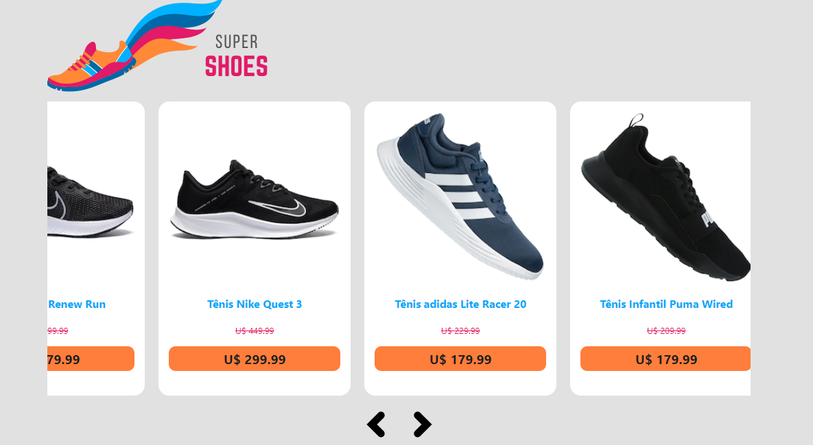

<h1> Carrossel  com React </h1>

 
 

 

## Sobre 
 
Fiz esse projeto para treinar as minhas habilidades seguindo as instruções do professor @emersonbroga. Neste projeto utilizei react, javascript, html e css. É um projeto simples que geralmente algumas empresas pedem na hora do processo seletivo. Como o próprio nome diz é um carrossel contendo informações como imagem, preço, modelo de varios modelos de tênis.   
    
